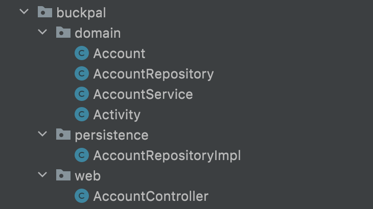
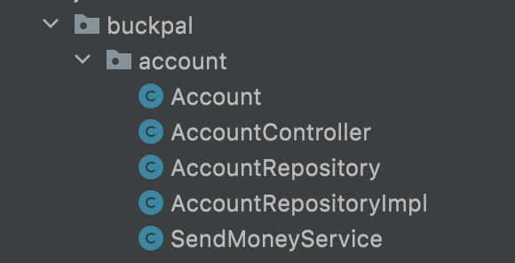
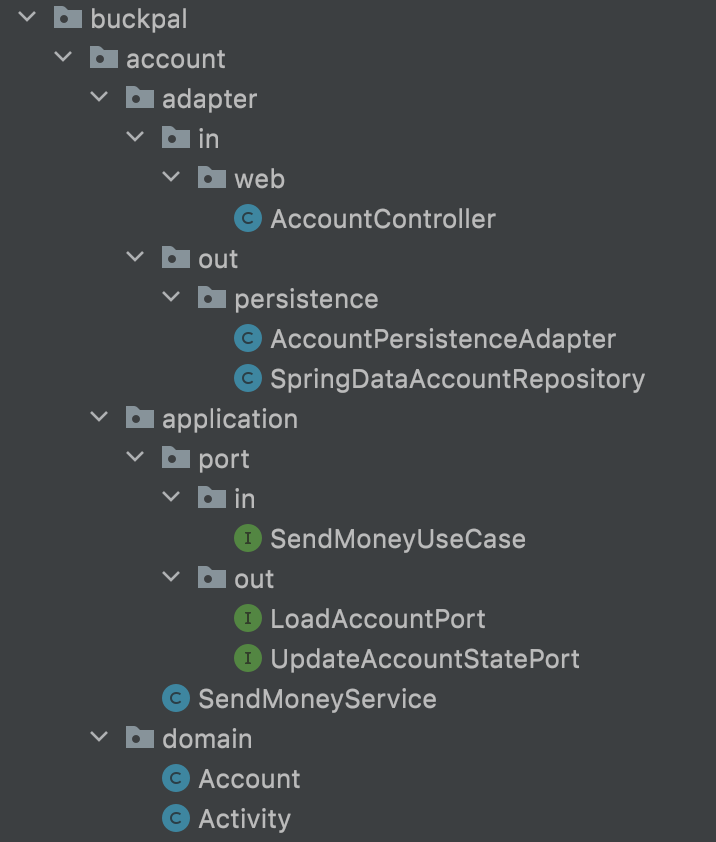
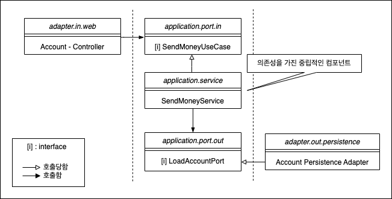

# 3장. 코드 구성하기

  

코드를 보는 것만으로도 어떤 아키텍처인지 파악할 수 있다면 좋지 않을까? (육각형 아키텍처의 목표)

  

## 계층으로 구성하기

  

위 계층은 웹 계층 / 도메인 계층 / 영속성 계층 각각에 대한 적용 패키지인 web, domain, persistence를 뒀다.

  
 

**적합한 구조가 아닌 이유**   

- 애플리케이션의 기능 조각이나 특성을 구분 짓는 패키지 경계가 없다.   
    만약 User 관리 기능을 추가한다면, web 패키지에 UserController, Persistence 패키지에 UserRepository, domain에 User, UserRepository, UserService 가 추가되어야 한다. 이는 서로 연관되지 않은 기능들끼리 예상하지 못한 부수효과를 일으킬 수 있는 클래스들의 엉망진창 묵음으로 변모할 가능성이 크다는 것이다.
- 애플리케이션이 어떤 유스케이스들을 제공하는지 파악할 수 없다.  
    AccountController와 AccountService가 각각 어떤 유스케이스를 구현했는지 파악하기 어렵다.
- 패키지 구조를 통해서는 우리가 목표로 하는 아키텍처를 파악할 수 없다.  
    어떤 기능이 웹 어댑터를 호출되는지, 영속성 어댑터가 도메인 계층에 어떤 기능을 제공하는지 한 눈에 알아볼 수 없다. 인커밍  포트와 아웃고잉 포트가 코드 속에 숨겨져있다.

 

> 인커밍 포트 : 외부로부터 값을 전달받는 포트  
> 아웃고잉 포트 : 외부로 값을 내보내는 포트

  
   

## 기능으로 구성하기

  

계층에 의한 패키징 방식보다 아키텍처의 가시성을 훨씬 더 떨어트림

- 어댑터를 나타내는 패키지명이 없다.
- 인커밍 포트, 아웃고잉 포트를 확인할 수 없다.
- package-private 접근 수준을 이용해 도메인 코드가 실수로 영속성 코드에 의존하는 것을 막을 수 없다.

 

## 아키텍처적으로 표현력 있는 패키지 구조
육각형 아키텍처에서 구조적으로 핵심적인 요소

- 엔티티
- 유스케이스
- 인커밍 / 아웃고잉 포트
- 인커밍 / 아웃고잉 어댑터

  

    

구조의 각 요소들은 패키지 하나씩에 직접 매핑된다. 

- account 패키지 : Account와 관련된 유스케이스를 구현한 모듈임을 나타낸다.
- domain 패키지 : 도메인 모델들이 속해있다.
- application 패키지 : 도메인 모델을 둘러싼 서비스 계층을 포함한다.
    - SendMoneyService는 인커밍 포트 인터페이스인 SendMoneyUseCase(포트를 통해서만 접근 가능하기 때문에 package-private으로 설정 가능)를 구현하고, 아웃고잉 포트 인터페이스이자 영속성 어댑터에 의해 구현된  LoadAccountPort와 UpdateAccountStatePort를 사용한다.
- adapter 패키지
    - 애플리케이션 계층의 인커밍 포트를 호출하는 인커밍 어댑터 포함
    - 애플리케이션 계층의 아웃고잉 포트에 대한 구현을 제공하는 아웃고잉 어댑터 포함

 

위 패키지의 구조는  **‘아키텍처-코드 갭’** 혹은 **‘모델-코드 갭'**을 효과적으로 다룰 수 있는 강력한 요소다. 이러한 용어는 대부분의 소프트웨어 개발 프로젝트에서 **아키텍처가 코드에 직접적으로 매핑될 수 없는 추상적 개념이라는사실을 보여준다.** 만약 패키지 구조가 아키텍처를 반영할 수 없다면 시간이 지남에 따라 코드는 점점 목표하던 아키텍처로부터 멀어지게 될 것이다.

의도적으로 어댑터에서 접근 가능해야 하는 포트들은 public이어야 하나, 서비스는 인커밍 포트 뒤에 숨겨질 수 있기 때문에 public일 필요가 없다.  

   

**장점**

- 코드와 아키텍처 간의 갭을 줄일 수 있게 해준다.  
- 현재 작업 중인 코드를 어떤 패키지에 넣어야 할지 계속 생각해야 하기 때문에 아키텍처에 대한 적극적인 사고를 촉진시킬 수 있다.  
- 애플리케이션 계층에서 어댑터 클래스로 향하는 우발적인 의존성은 있을 수 없다.
    - 애플리케이션 계층의 아웃고잉 포트를 통해 영속성 클래스에 접근이 가능하다.
- 어댑터 코드를 자체 패키지로 이동시키면 필요할 경우 하나의 어댑터를 다른 구현으로 쉽게 교체할 수 있다.   
-  DDD 개념에 직접적으로 대응시킬 수 있다.

 

표현력 있는 패키지 구조는 적어도 코드와 아키텍처 간의 갭을 줄일 수 있게 해준다.

  
 
 

## 의존성 주입의 역할

**클린 아키텍처의 가장 본질적인 요건 : 애플리케이션 계층이 인커밍/ 아웃고잉 어댑터에 의존성을 갖지 않는 것**

 

**의존성 역전 원칙을 이용하는 방법**  
애플리케이션 계층에 인터페이스를 만들고 어댑터에 해당 인터페이스를 구현한 클래스를 두면 되며, 육각형 아키텍처에서는 이 인터페이스가 포트가 된다.

 

모든 계층에 의존성을 가진 중립적인 컴포넌트를 하나 도입한다.  
- 수동으로 초기화 할 일이 없어진다.
- 애플리케이션 계층에 어댑터에 대한 의존성을 추가하지 않아도 된다.
- 이 컴포넌트는 아키텍처를 구성하는 대부분의 클래스를 초기화하는 역할을 한다.

 

  

Account Controller - SendMoneyUseCase 인터페이스 필요 → 의존성 주입을 통해 SendMoneyService 클래스의 인스턴스 주입

Account Controller는 SendMoneyService의 존재를 모른다.