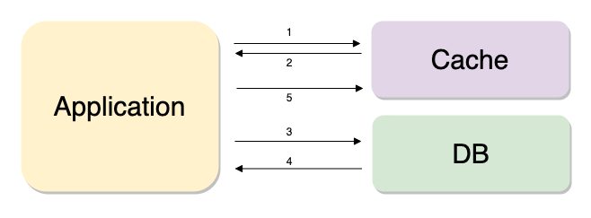

# Redis

### 캐시란?
데이터의 원래 소스보다 더 빠르고 효율적으로 액세스 할 수 있는 임시 데이터 저장소  
속도 향상을 위해서 캐시를 사용, 데이터의 재사용 횟수가 한번이상인 데이터를 저장하는 것이 좋아며 잘 변하지 않는 데이터일수록 좋다.

### 레디스가 캐시로 사용하기 좋은 이유?
- 단순히 key-value로 구성되어있기 때문에 사용하기 편리하다.
- In-memory 데이터 저장소(RAM)로서 데이터를 읽고 쓰는 속도가 빠르다.
- 빠른 성능 : 평균 작업속도 < 1ms / 초당 수백만 건의 작업 가능

 

## 캐싱 전략
래디스를 캐시로 사용할 때 어떻게 배치하는지에따라 시스템의 성능에 영향을 끼칠 수 있다.  
데이터의 유형과 해당 데이터에 대한 엑세스 패턴을 잘 고려해서 선택해야 한다.

### 데이터 읽기 전략 - Look-Asied(Lazy Loading)  

1. 데이터 필요 시 Cache에 접근하여 데이터 조회
    - 데이터 있을 시 : Cache값 사용
2. 데이터가 없다면 DB에 접근하여 데이터 조회
3. 조회한 데이터를 Cache에 저장

 

장점  
Redis가 다운되더라도 바로 장애로 이어지지 않고 DB에서 데이터를 가져올 수 있다.

단점 
- Cache에 붙어있던 커넥션이 많았다면 그 커넥션이 모두 DB로 붙기 때문에 DB에 갑자기 많은 부하가 몰릴 수 있다.
- 캐시 미스 발생 시에만 데이터를 작성하므로 데이터가 최신화 되어있지 않을 수 있다.  
- 캐시 미스 발생 시 아래 3작업을 진행해야 하므로 딜레이가 발생할 수 있다.  
    1. 캐시에 상태 데이터 확인 요청
    2. 데이터베이스에 데이터 확인 요청
    3. 캐시에 데이터 작성

 

> cache Warming  
> 캐시미스가 많을 시 DB에서 캐시로 데이터를 밀어 넣어주는 작업을 해줘야한다.

 
 

### 데이터 쓰기 전략
- **write-Around**  
    - DB에만 데이터를 저장하고 캐시미스가 발생한 경우 DB의 데이터를 캐시로 가져오는 작업을 말한다.
    - 캐시 내의 데이터와 DB내의 데이터가 다를 수 있다는 단점이 있다.

- **Write-Through**
    - DB에 데이터를 저장할 때 캐시에도 데이터를 저장한다.
    - 캐시는 항상 최신정보를 가지고 있다는 장점이 있다.  
      그러나 저장할때마다 두 단계를 거쳐야해기때문에 상대적으로 느리다.
    - 저장하는 데이터가 재사용되지 않을 수도 있는데 무조건 캐시에 저장되기 때문에 리소스 낭비일 수도 있다.
    -  데이터 저장 시 몇 분, 혹은 몇 시간만 데이터를 저장하겠다는 의미인 expire time을 지정해주는 것이 좋다.

> TTL(Time To Live) 지정   
> key가 자연스럽게 만료되어 없어지게 하는 시간을 지정해주는 것을 권장한다.

 
 

## Redis DataType
- String - set command 사용  
- Bitmaps  
- List 
    - 큐로 사용하기 좋음  
- hashes 
    - 또 다시 여러개의 필드와 밸류 쌍으로 분류  
- set 
    - 중복되지 않는 문자열의 집합  
- sorted set 
    - score라는 숫자값으로 정렬되며 중복되지 않는 값을 저장한다. 
    - score가 같을 시에는 사전순으로 정렬
- HyperLogLogs 
    - 굉장히 많은 데이터를 다루며 중복되지 않는 값의 개수를 카운트할 때 사용  
    - 모든 스트링 데이터 값을 유니크하게 보관 가능 
    - 저장되는 용량은 매우 작음(12KB 고정되어 저장) 
    - 한번 저장된 값은 다시 확인할 수 없음. 
    - 데이터 보호 목적으로는 좋음  
- Streams 
    - 로그 저장 시 유용  

 
 

## Redis 데이터를 영구 저장
In Memory 데이터 스토어로 서버 재시작 시 모든 데이터가 유실되며 복제 기능을 사용해도 사람의 실수 발생 시 데이터 복원 불가하다. Redis를 캐시 이외의 용도로 사용한다면 적절한 데이터 백업이 필요하다.

### 영구 저장 2가지 방법
- AOF (Append Only File)  
Redis의 입력/수정/삭제 명령 실행 시 모든 명령이을 기록하는 형식이다.  
 데이터 손실이 거의 없으나, 명령어 수행과 저장 사이에 서버가 다운되면 데이터 손실 우려 있다.  
저장하는 파일이 너무 크면 OS파일 사이즈에 제한이 걸리거나, Redis 서버를 켰을 때 AOF파일을 로드하는 시간이 오래 걸릴 수 있다.  
파일의 크기를 기준으로 해서 압축 시점 지정 가능하다.

    - 자동 : redis.conf파일에서 auto-aof-rewrite-percentage옵션(크기기준)
    - 수동 : BGREWRITEAOF커맨드를 이용해 CLI창에서 수동으로 AOF파일 재작성

- RDB snapshot   
스냅샷 방식으로 동작 저장 당시에 메모리에 있는 데이터 그대로를 사진 찍듯 찍어서 저장한다. 시간단위로 파일 저장이 가능하다.  
    - 자동 : redis.conf 파일에서 SAVE옵션(시간 기준)
    - 수동 : BGSAVE커맨드를 이용해 cli 창에서 수동으로 RDB 파일 저장
SAVE 커맨드는 절대 사용 X

 

**백업은 필요하지만 어느 정도의 데이터 손실이 발생해도 괜찮은 경우**  
- RDB 단독 사용  
장애 상황 직전까지 모든 데이터가 보장되어야 할 경우
redis.conf파일에서 SAVE옵션을 적절히 사용 

- AOF사용(apendonly yes)  
APPENDSYNC 옵션이 everysec인 경우 최대 1초 사이의 데이터 유실 가능(기본 설정)

- 제일 강력한 내구성이 필요한 경우 -> RDB&AOF동시 사용

 
 

## Redis 아키텍처
모든 복제는 비동기식으로 이루어진다.

- Replication  
    - 마스터와 리플리카만 존재하는 간단한 구조로 단순히 복제만 연결된 구조
    - replicaof 커맨드를 이용해 간단하게 복제 연결
    - HA기능이 없으므로 마스터 장애 발생 시 수동으로 변경해주어야 함
        - replicaof no one으로 복제 끊음
        - 애플리케이션에서 연결 설정 정보 변경  
- Sentinel  
    - 마스터와 리플리카 노드 이외에 센티널 노드 필요하며 센티널은 일반 노드들을 모니터링하는 역할을 한다.
    - 마스터 비정상 상태 시 자동으로 페일오버 발생하여 기존의 리플리카가 마스터가 되며 기존의 마스터는 리플리카로 강등당한다.
    - 연결 정보 필요 없음
    - Sentinel 노드는 항상 3대 이상의 홀수로 존재해야 한다.  
    → 과반수 이상의 센티널이 동의해야 페일오버 진행
- Cluster
    - 최소 3대의 마스터가 필요하며 샤딩 기능을 제공한다.
    - 샤딩 : 데이터가 여러 마스터노드에 자동으로 분할해서 저장되는 것
    - 모든 노드가 서로를 감시하며 마스터 비정상 상태 시 리플리카는 자동으로 마스터로 승격한다.
    기존의 마스터 복구 시에는  스스로 리플리카로 강등한다.
    - 최소 3대의 마스토 노드 필요 → 마스터당 리플리카 노드 필요

 
 

### 어떨 때 사용해야 될까?
HA기능이 필요한가?  
- Yes - 샤딩 기능 필요?   
    → yes :  Cluster(서비스의 확장을 위해 스케일 아웃이 필요하다면)  
    → no : sentinel  
- No - 복제 기능이 필요한가?  
    → no : Stand-Alone  
    → yes : replication  

 

## 사용 시 꿀팁
- Redis는 Single Thread로 동작한다. 모든 키를 가져오는 `keys *`같은 명령어 실행 시 데이터량이 많으면 작업이 오래걸리게 되고 그 후 사용자는 대기를하게 된다. 이 때, keys * → scan으로 대체하여 사용하면 재귀적으로 key들을 호출 가능하다. 또한, 키내부에 데이터가 많아질수록 성능 저하 문제가 발생할 수 있기때문에, 하나의 키에 최대 100만개 이하로 보유하도록 키를 적절하게 나누는 것이 좋다.

- 위와 마찬가지로 키에 데이터가 많을 때 삭제를 진행하면 작업이 끝날때까지 아무것도 하지 못하게 된다. del명령어 대신 Unlink 명령어를 실행해 준다면 key 삭제를 백그라운드로 실행할 수 있다.

 

### 변경하면 장애를 막을 수 있는 기본 설정 값  
`STOP-WRITES-ON-BGSAVE-ERROR = NO`  :  yes(default)  
RDB파일 정상적으로 저장이 되지 않을 때, redis로의 모든 write 차단하는 기능이다.
만약, 레디스 서버 모니터링을 적절히 하고있다면 이 기능을 no로 설정하는 것이 장애를 방지할 수 있다.

`MAXMEMORY-POLICY = ALLKEYS-LRU`  
redis를 캐시로 사용할 때 Expire Time 설정 권장하며 메모리가 가득 찼을 때 MAXMEMORY_POLICY정책에 의해 키를 관리하게 된다.
- noeviction(default) : 삭제 안함 → 더 이상 저장 안함 → 에러 발생  
- volatile-Iru → 가장 최근에 사용하지 않았던 키부터 삭제 expire설정 값이 있는 key값만 삭제한다.  
- **allkeys-Iru** → 모든 key에 대해 LRU방식으로 삭제 / 추천 

> 이후 꿀팁은 아래 youtube영상 참고!

 
 

### 참고  
youtube.com/watch?v=92NizoBL4uA&t=1101s  
https://cla9.tistory.com/101