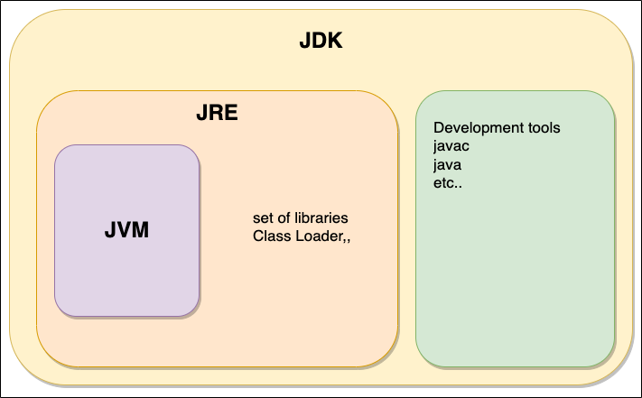

 

## JVM (Java Virtual Machine)

자바 가상머신으로 Java 소스코드로부터 만들어지는 자바 바이너리 파일(.class)를 실행할 수 있다.  
JVM자체는 플랫폼에 의존적이나 컴파일된 바이너리 코드는 어떤 JVM에서도 동작시킬 수 있다.  
최소한의 배포단위는 JRE이며 JVM 홀로 배포 될 수 없다.
  
 

## JRE(Java Runtime Environment)

자바 애플리케이션을 실행할 수 있도록 구성된 배포판으로 JVM, Java Class Libraries, Class Loader라는 요소로 구성된다.  
개발에 사용되는 것이 아닌 실제 프로그램을 구동시키는데 집중하고 있어 개발관련 도구는 제공되지 않는다.  

   

## JDK (Java Development Kit)

Java를 활용하여 프로그램을 개발할 때 필요한 도구 모음이다.   
JRE + 개발에 필요한 툴( javac와 같은 컴파일러, 디버거 등을 포함 )  
소스 코드를 작성할 때 사용하는 자바 언어는 플랫폼에 독립적이다.  

  

## 참고
https://wikidocs.net/257  
https://tecoble.techcourse.co.kr/post/2021-07-12-jvm-jre-jdk/