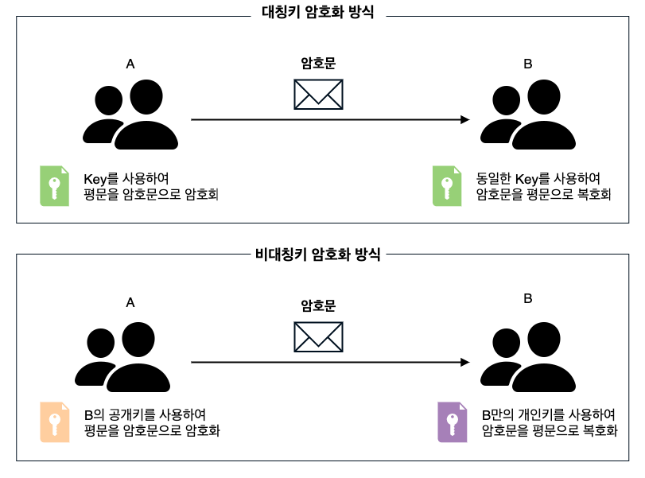
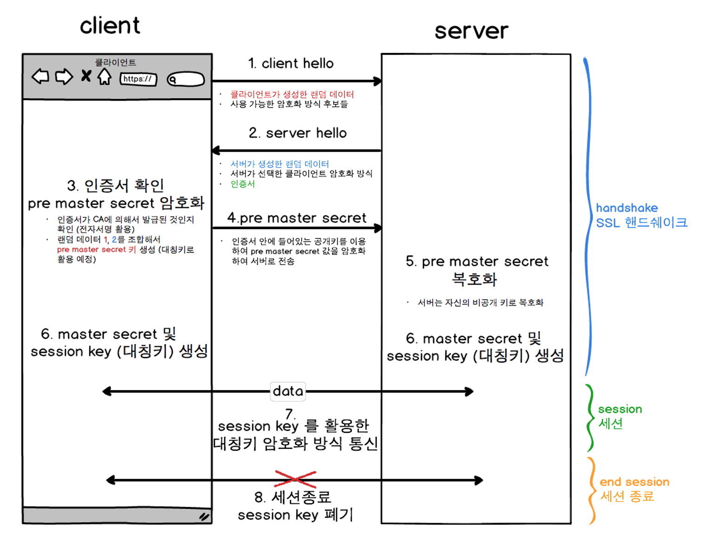

## SSL/TLS란?

SSL (Secure Socket Layer)
-  네스케이프에 의해 발명
- 컴퓨터 네트워크에 통신 보안을 제공하기 위해 설계된 암호 규약
 - TCP/IP 네트워크를 사용하는 통신에 적용
 - 주로 HTTP, FTP, TELNET 등과 같은 프로토콜에 SSL과 같은 보안 프로토콜을 결합하여 HTTPS,  SFTP, SSH 등과 같은 프로토콜로 사용

TLS (Transport Layer Security)
- SSL이 폭넓게 사용되 표준화기구인 IETF의 관리로 변경되며 TLS로 이름 변경
- 그러나 SSL이라는 이름이 더 널리 쓰이며 오픈소스도 OPENSSL로 규명 되어짐

 
 

## SSL인증서란?
클라이언트와 서버 간의 통신 안정을 보증해주는 문서
- 기능  
    - 클라이언트가 접속한 서버가 신뢰 가능한 서버임을 보장
    - SSL 통신에 사용할 공개키를 클라이언트에게 제공
- 이용하는 이유
    - 통신 내용이 공격자에게 노출되는 것을 방지
    - 클라이언트가 접속하려는 서버가 신뢰할 수 있는 서버인지 판단
    - 통신 내용의 악의적인 변경 방지

 

> CA (Certificate authority) 란?  
> TLS 통신을 위해 SSL 인증서를 발급해주는 인증기관으로 Root Certificate라고도 함
> 클라이언트가 접속한 서버가 정상적인 서버가 맞는지 확인하고, 맞다면 인증서를 제공해주는 역할
> 기업의 종류 : Symantec, Comodo, GoDaddy  GlobalSign

> 사설 인증기관  
> 개발이나 사적인 목적을 위해 SSL의 암호화 기능을 이용한다면 직접 CA역할을 할 수도 있음

 

### 인증서 구조
- 3계층으로 구성 → 인증서 체인
- Root 인증서   
    - 가장 최상위 위치한 인증서로 세상 사람들이 모두 신뢰하기로 약속한 기관에서 발급 
    - 웹 브라우저 등에 미리 내장되어 있으며 해당 인증서에 대응하는 공개키 또한 인증서 내부에 포함되어 있음
    - 스스로를 사인해줄 상위 기관이 없기 때문에 스스로 보증을 함 
- 중간 인증서  (Intermediate ) 
    - 상위 기관으로 인증서 내용물을 전달하고 상위 기관의 비밀키로 암호화 하여 받은 인증서
    - chain of trust : 상위 계층의 인증서가 신뢰할 수 있는 기관이라면 해당 인증서의 비밀키로 암호화된 하위 인증서 또한 신뢰 가능한 인증서 
    - Leaf 인증서(사용자가 구입하는 SSL 인증서)

 

### 인증서 내용물
- 인증서 소유자 이름
- 인증서 소유자의 공개키
- 인증서의 유효기간
- 고유한 UID
- 인증서의 내용을 모두 해시화한 값
- 위 해시화한 값을 암호화한 값

 
 

## 암호화 종류

**대칭키 암호화 방식**
- 동일한 하나의 키로 암호화와 복호화를 하는 기법
- 단점 : 암호를 주고 받는 사람들 사이에  대칭키를 전달하는 과정에서 유출 될 수 있다.

**공개키 암호화 방식 (= 비대칭키 암호화 방식)**
- 서로 다른 두개의 키를 한 쌍으로 묶어 각각 암호화/복호화 하는 기법
- 비공개키(private key, 개인키, 비밀키) : 자신만 가지고 있는 키
- 공개키 (public key) : 타인에게 제공하는 키
A키로 암호화  → B키로 복호화 / B키로 암호화 → A키로 복호화

 
 

## Linux환경에서 실습해보기

### 대칭키 암호화 방식
1. 임의의 파일 생성  
`echo 'this is ssl' > ssltest.txt'`

2. openssl을 이용하여 txt파일로 대칭키 생성 (아래 명령어 작성 후 비밀번호를 입력해주면 된다.)
    > enc -e -des3 : des3방식으로 암호화 함
    > -in ssltest.txt -out ciphertext.bin : ssltest.txt파일을 암호화 한 결과를 ciphertext.bin파일에 저장

    `openssl enc -e -des3 -salt -in ssltest.txt -out ciphertext.bin;`  
    enter des-ede3-cbc encryption password:   
    Verifying -enter des-ede3-cbc encryption password:

3. ciphertext.bin 파일을 ssltest2.txt로 복호화 (아까 설정한 비밀번호로 입력으로 복호화 진행)  
`openssl enc -d -des3 -in ciphertext.bin -out ssltest2.txt`  
enter des-ede3-cbc encryption password: 

4. ssltest2.txt내용확인  
`cat ssltest2.txt`  
결과 > this is ssl

 

### 공개키 암호화 방식 
1. 1024bit의 길이를 갖는 private.pem 이름의 비공개키 생성  
`openssl genrsa -out private.pem 1024;`

2. private.pem에 대한 공개키 public.pem 생성  
`openssl rsa -in private.pem -out public.pem -outform PEM -pubout;`

3. 임의의 파일 생성  
`echo 'Hello ssl' > file.txt`

4. 임의의 파일을 공개키로 암호화  
`openssl rsautl -encrypt -inkey public.pem -pubin -in fild.txt -out fild.ssl`

5. 공개키로 암호화한 fild.ssl을 비공개키로 복호화하여 txt파일로 생성  
`openssl rsautl -decrypt -inkey private.pem -in file.ssl -out decrypted.txt`   
`cat decrypted.txt`  
결과 > Hello ssl

 
 

## SSL통신 - handshake

1. Client Hello
- 클라이언트가 서버에 접속하는 과정
- 클라이언트에서 생성한 랜덤 데이터, 암호화 방식 전송

2. Server Hello
- 클라이언트의 Client Hello에 대한 응답
- 서버에서 생성한 랜덤 데이터, 결정된 암호화 방식, 서버의 공개키가 담긴 인증서 전송

3. Premaster Secret
- Server Hello로부터 받은 인증서 확인  
- 인증서 발급기관, CA가 브라우저의 CA 목록에 있는지 확인   
 → CA의 공개키로 인증서를 복호화   
 → 신뢰할 수 있는 서버 인증 & Client Hello 랜덤 데이터 + Server Hello 랜덤 데이터 = premaster secret 키 생성  
 → Server Hello로부터 받은 공개키로 premaster secret키 암호화 후 전송  

4. Master secret + session key
- premaster secret를 개인키로 복호화 후 master secret 값으로 저장
- master secret로 브라우저와 대칭키 암호화에 사용할 session key 생성

5. SSL handshake 종료 / HTTPS 통신 시작
- 대칭키 방식으로 통신

 
 

## JAVA 프로젝트에 적용하기

 
 

### 참고
https://opentutorials.org/course/228/4894#public  
https://brunch.co.kr/@sangjinkang/38  
https://velog.io/@jummi10/keytool로-local에서-SSL-인증서-생성-및-적용  
https://medium.com/finnq-tech/key-store-and-trust-store-in-java-36a47490983b  
https://m.blog.naver.com/alice_k106/221468341565  
https://ssungkang.tistory.com/entry/  Web-SSL-인증서에-대한-이해사전-지식-정의-동작원리-인증서-비교  
https://wayhome25.github.io/cs/2018/03/11/ssl-https/  
